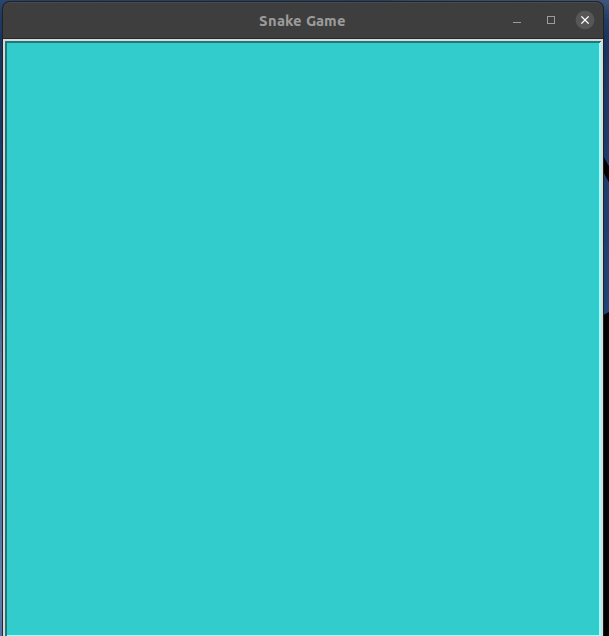
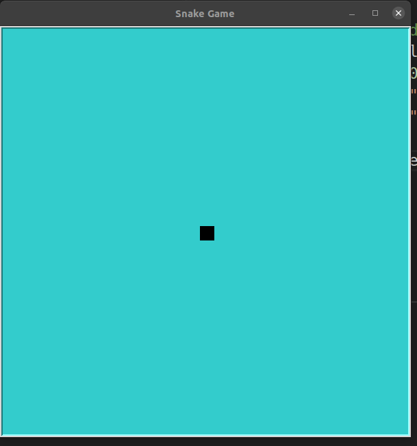
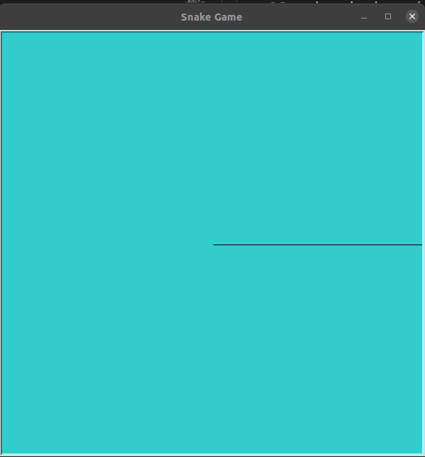

## Python Snake Game Using Turtle

This is a step-by-step guide to how I code this project.

This code is on: https://www.edureka.co/blog/python-turtle-module/ and this youtube tutorial: https://www.youtube.com/watch?v=BP7KMlbvtOo&list=PLlEgNdBJEO-n8k9SR49AshB9j7b5Iw7hZ&index=1

# Table of content:
1. [Setup the canvas](#canvas)
2. Setup Head of Snake
3. Setup Food
4. Move Snake
5. 

<a name='canvas'></a>
## 1. Setting up the canvas
import turle and then create the screen object.  
```
# Setup the screen
scr = turtle.Screen()
scr.bgcolor("#33cccc")
scr.setup(600,600)
scr.title("Snake Game")
```
If you run this, you will find a screen pop up and quickly closes. Add this line ``` turtle.Screen().exitonclick() ``` so that you can close it by clicking it.

If you run snake01.py, this is what you will get:



## 2. Set up the head of the snake
```
head = turtle.Turtle()
head.speed(0)
head.shape("square")
head.color("black"
```

Running snake02.py will show a small square in the middle of the canvas.  This is the head of our snake.



## 3. Move the snake
I am going to define a function for this:
```
def move():
    if head.direction == "right":
        x = head.xcor()
        head.setx(x + 20)
```
For now, I just want to test if this works.  There are 2 lines we need to add under # Snake Head.  First is:
```
head.penup()
```
We do not want to draw a line while the snake is moving.  Turtle is essentially a program to animate drawing.  By default, you will see a line when you move an object from one position to another.

Second being:
```
head.direction = "right"
```
We set the initial direction of the snake to go right.  So that the function mov() will be activated and set the snake to move 20 pixel to the right.

Now we do the fun part, adding a 'loop'. By looping, we create a sense of motion much like playing a film strip.
```
# Game loop
while True:
    scr.update()
    move()

scr.mainloop()
```
If you run snake03.py, you will see the snake run off the screen to the right.

It's not very interesting but it shows that the code is running.

## 4 Adding delay
Our snake is running too fast.  We need a little bit of delay or else our game would be unplayable.
```
import time
delay = 0.1
```
The time function let us accomplish that.  We will set our delay to 0.1s.
Add
```
time.sleep(delay)
```
to our game loop will slow each loop or "frame" by the delay we specified.
